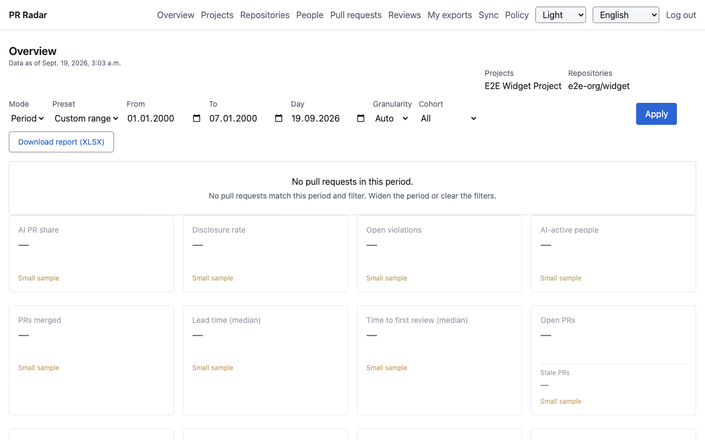
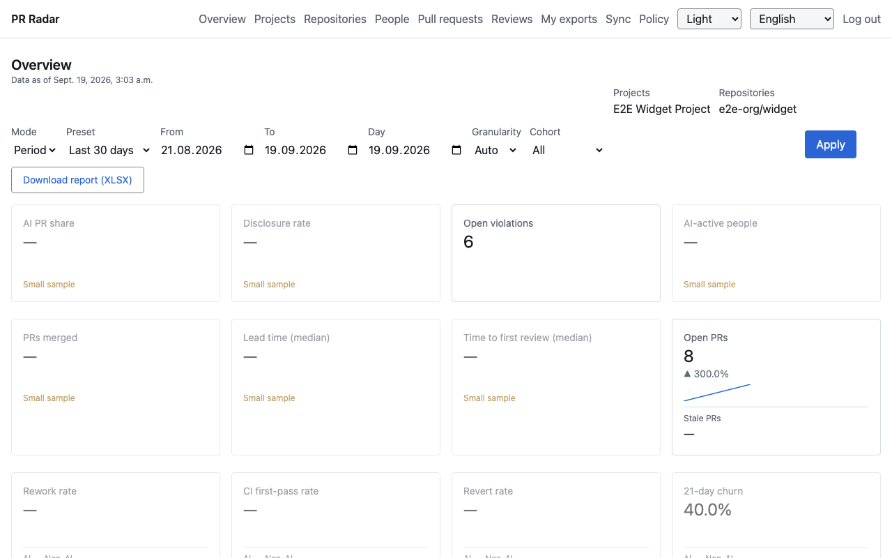
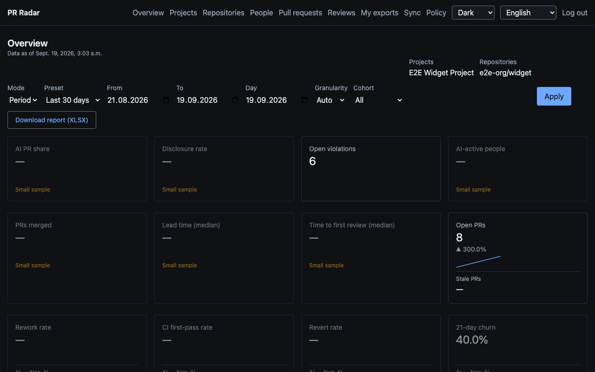
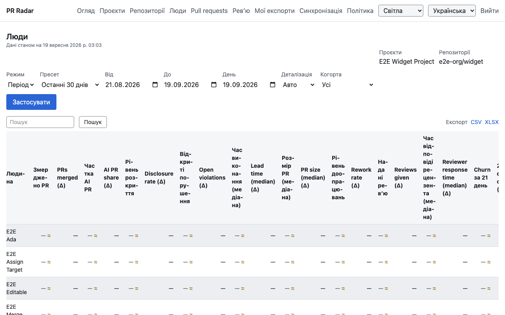
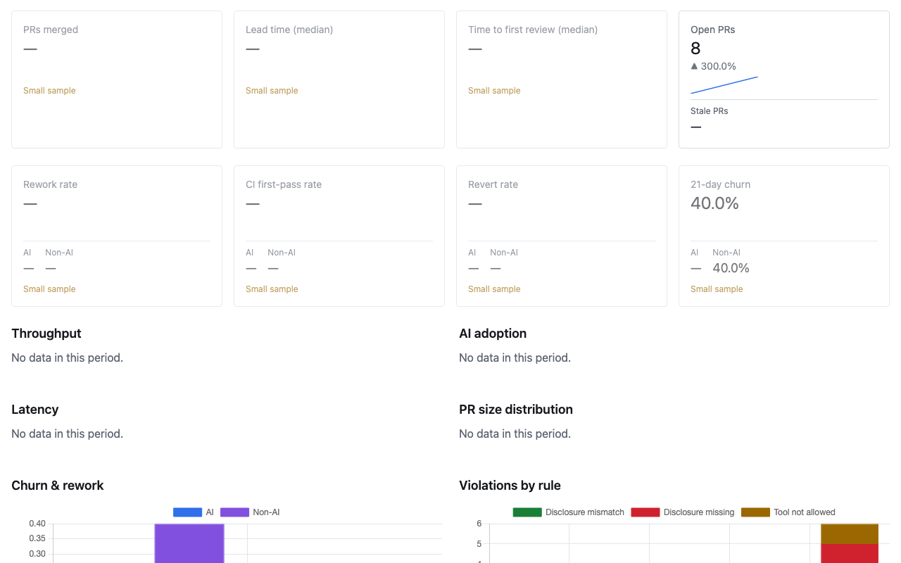
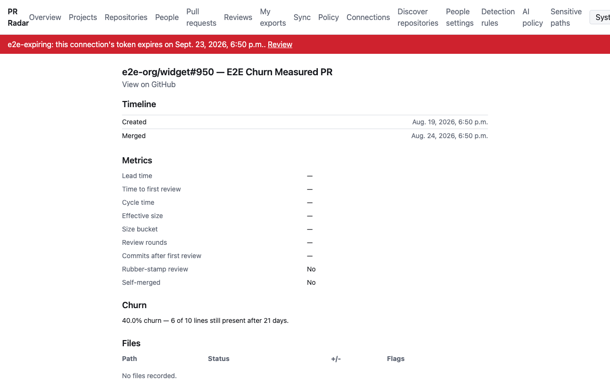
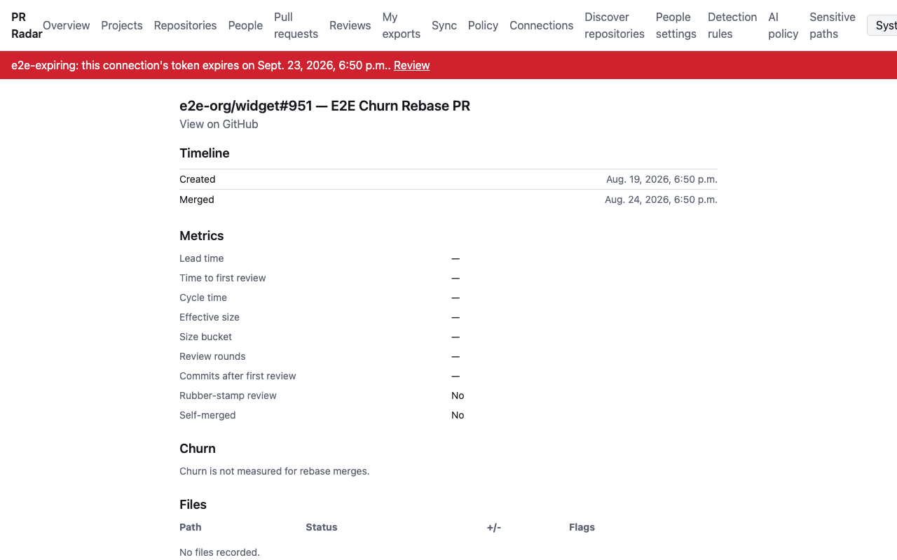
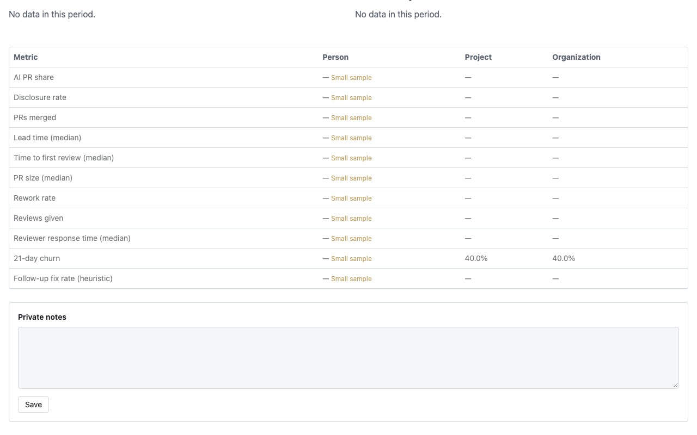

# PR Radar — screens

The product as the run left it, newest phase first. Every frame was captured by the phase that shipped what it
shows, against the running `make e2e-up` surface with `manage.py seed_e2e` data — a deliberately small dataset,
which is why most metrics read "Small sample". Nothing here was re-captured for this page.

Only phases 10 and 11 captured frames. Phases 1–9 shipped the pages these frames show, but photographed none of
them.

---

## Phase 11 — Polish, performance and documentation

Source: [`phases/11-polish-and-performance/SCREENS.md`](phases/11-polish-and-performance/SCREENS.md)

### Page-level empty state

A custom period with zero seeded PRs. The shared empty-state partial explains the two reachable causes ("No pull
requests match this period and filter. Widen the period or clear the filters.") while the filter bar and every KPI
card stay rendered underneath — the page gains a sentence, it does not lose content.

### MIN_SAMPLE greying on the Overview KPI grid

Most seeded metrics fall below `MIN_SAMPLE` (5): those cards render at reduced opacity with an explicit "Small
sample" text label under the value — never colour alone. "Open violations" and "Open PRs" clear the threshold and
render at full strength.

*Earlier capture of the same Overview page, showing the Quality KPI row:*
[phase 10, frame 01](phases/10-ci-and-churn/SCREENS.md).

### Dark theme, same Overview page

`data-theme="dark"` with the retuned dark-mode tokens: body text, muted text, the warning-coloured "Small sample"
label and the KPI delta arrow all stay legible on the dark surfaces. A spot check of
`tests/test_token_contrast.py`, not a substitute for it.

### Ukrainian UI on the People table

Language switched to `uk`. Long Ukrainian headers ("Відкриті порушення", "Час виконання (медіана)") wrap onto two
lines with `hyphens-auto` instead of clipping, and every metric cell carries the small-sample `≈` glyph with its
tooltip. **Visible and unfixed:** the `(Δ)`-suffixed delta columns ("PRs merged (Δ)", "AI PR share (Δ)", …) are
still English — the base metric column translates but its delta variant does not. A residual proofread gap, not a
capture artifact.

---

## Phase 10 — CI first-pass, follow-up fixes and churn

Source: [`phases/10-ci-and-churn/SCREENS.md`](phases/10-ci-and-churn/SCREENS.md)

### Quality KPI row on the Overview dashboard

Rework rate, CI first-pass rate, Revert rate, 21-day churn. Churn reads 40.0% for both AI and non-AI columns,
greyed "Small sample" — one seeded `ChurnResult` row. CI first-pass rate shows "—"/"Small sample" because the
e2e seed has no `CheckStatus` rows, so this frame does **not** prove `ci_first_pass_rate`'s numeric path; that is
`apps/metrics/tests/test_metrics_quality.py`.

*Superseded for the general KPI-grid view by* [phase 11, frame 02](#min_sample-greying-on-the-overview-kpi-grid)
*— the Quality row itself was not re-captured.*

### PR detail — a computed churn percentage

`e2e-org/widget#950`'s Churn section: "40.0% churn — 6 of 10 lines still present after 21 days." A full sentence
with named placeholders, not a bare percentage.

### PR detail — rebase merge, unsupported

`e2e-org/widget#951`, merged by rebase: "Churn is not measured for rebase merges." No percentage, and no stray
"Churn not computed yet." text.

### Person page — the heuristic label on screen

The Person page's Metric / Person / Project / Organization comparison table: "21-day churn" (40.0% at project and
organization scope) and "Follow-up fix rate (heuristic)" — the label sits in the metric's title, not in a tooltip
or a footnote.

---

## What no frame shows

Photographed by neither phase, and mostly unphotographable:

- **Every page shipped before phase 10** — Connections, Repositories, Sync, People settings and the
  unmapped-identity queue, Detection rules, AI policy, Sensitive paths, the Policy console, the Projects and
  Repositories dashboards, the Pull requests list, the Reviews page and the exports pages. All are covered by
  the e2e suite; none was captured.
- **The bare-clone lifecycle, `GIT_ASKPASS`, the git-blame algorithm and the nightly `compute_churn` schedule** —
  subprocess and filesystem work with no page of its own.
- **`too_large` and `error` churn statuses on the PR detail page** — deferred by `e2e/plans/churn.plan.yaml` to
  `apps/dashboards/tests/test_pull_request_detail.py`; no seeded PR reaches either state.
- **`seed_demo --scale large` at 50 repositories / 20,000 PRs and the resulting dashboard latency** — a timing
  number, pinned by `tests/test_performance.py`.
- **The full contrast-audit token×token table** — asserted exhaustively by `tests/test_token_contrast.py`.
